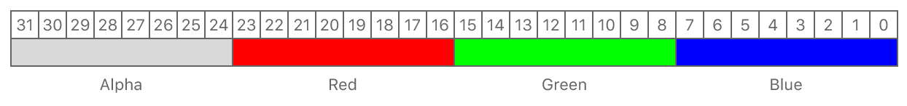
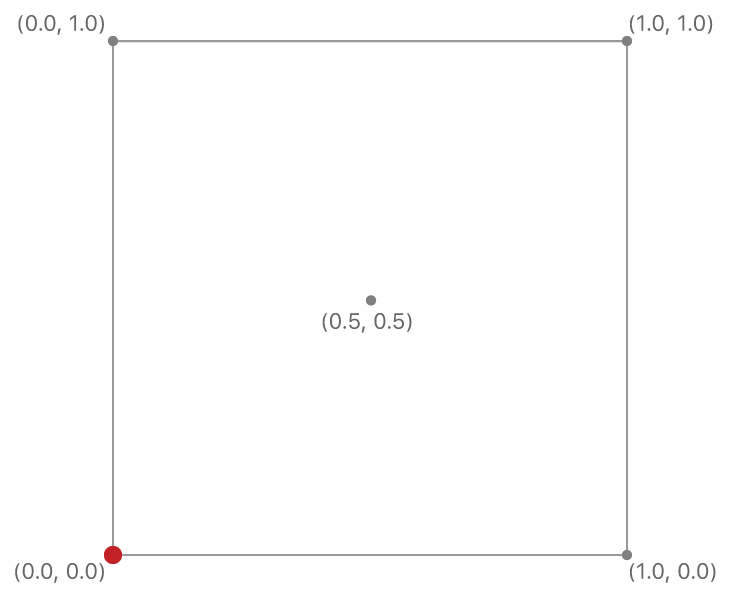

# MetalBT709Decoder

Proper rendering of BT.709 encoded H.264 image using Metal

## Overview

In the [Basic Buffers](https://developer.apple.com/documentation/metal/basic_buffers) sample, you learned how to render basic geometry in Metal.

In this sample, you'll learn how to render a 2D image by applying a texture to a single quad. In particular, you'll learn how to configure texture properties, interpret texture coordinates, and access a texture in a fragment function.

## Getting Started

The Xcode project contains schemes for running the sample on macOS, iOS, or tvOS. Metal is not supported in the iOS or tvOS Simulator, so the iOS and tvOS schemes require a physical device to run the sample. The default scheme is macOS, which runs the sample as is on your Mac.

## Images and Textures

A key feature of any graphics technology is the ability to process and draw images. Metal supports this feature in the form of textures that contain image data. Unlike regular 2D images, textures can be used in more creative ways and applied to more surface types. For example, textures can be used to displace select vertex positions, or they can be completely wrapped around a 3D object. In this sample, image data is loaded into a texture, applied to a single quad, and rendered as a 2D image.

## Load Image Data

The Metal framework doesn't provide API that directly loads image data from a file to a texture. Instead, Metal apps or games rely on custom code or other frameworks, such as Image I/O, MetalKit, UIKit, or AppKit, to handle image files. Metal itself only allocates texture resources and then populates them with image data that was previously loaded into memory.

In this sample, for simplicity, the custom `AAPLImage` class loads image data from a file (`Image.tga`) into memory (`NSData`).

- Note: The `AAPLImage` class isn't the focal point of this sample, so it isn't discussed in detail. The class demonstrates basic image loading operations but doesn't use or depend on the Metal framework in any way. Its sole purpose is to facilitate loading image data for this particular sample.

This sample uses the TGA file format for its simplicity. The file consists of a header describing metadata, such as the image dimensions, and the image data itself. The key takeaway from this file format is the memory layout of the image data; in particular, the layout of each pixel.

Metal requires all textures to be formatted with a specific `MTLPixelFormat` value. The pixel format describes the layout of each of the texture's pixels (its *texels*). To populate a Metal texture with image data, its pixel data must already be formatted in a Metal-compatible pixel format, defined by a single `MTLPixelFormat` enumeration value. This sample uses the `MTLPixelFormatBGRA8Unorm` pixel format, which indicates that each pixel has the following memory layout:



This pixel format uses 32 bits per pixel, arranged into 8 bits per component, in blue, green, red, and alpha order. TGA files that use 32 bits per pixel are already arranged in this format, so no further conversion operations are needed. However, this sample uses a 24-bit-per-pixel BGR image that needs an extra 8-bit alpha component added to each pixel. Because alpha typically defines the opacity of an image and the sample's image is fully opaque, the additional 8-bit alpha component of a 32-bit BGRA pixel is set to 255.

After the `AAPLImage` class loads an image file, the image data is accessible through a query to the `data` property.

``` objective-c
// Initialize a source pointer with the source image data that's in BGR form
uint8_t *srcImageData = ((uint8_t*)fileData.bytes +
                         sizeof(TGAHeader) +
                         tgaInfo->IDSize);

// Initialize a destination pointer to which you'll store the converted BGRA
// image data
uint8_t *dstImageData = mutableData.mutableBytes;

// For every row of the image
for(NSUInteger y = 0; y < _height; y++)
{
    // For every column of the current row
    for(NSUInteger x = 0; x < _width; x++)
    {
        // Calculate the index for the first byte of the pixel you're
        // converting in both the source and destination images
        NSUInteger srcPixelIndex = 3 * (y * _width + x);
        NSUInteger dstPixelIndex = 4 * (y * _width + x);

        // Copy BGR channels from the source to the destination
        // Set the alpha channel of the destination pixel to 255
        dstImageData[dstPixelIndex + 0] = srcImageData[srcPixelIndex + 0];
        dstImageData[dstPixelIndex + 1] = srcImageData[srcPixelIndex + 1];
        dstImageData[dstPixelIndex + 2] = srcImageData[srcPixelIndex + 2];
        dstImageData[dstPixelIndex + 3] = 255;
    }
}
_data = mutableData;
```

## Create a Texture

A `MTLTextureDescriptor` object is used to configure properties such as texture dimensions and pixel format for a `MTLTexture` object. The `newTextureWithDescriptor:` method is then called to create an empty texture container and allocate enough memory for the texture data.

``` objective-c
MTLTextureDescriptor *textureDescriptor = [[MTLTextureDescriptor alloc] init];

// Indicate that each pixel has a blue, green, red, and alpha channel, where each channel is
// an 8-bit unsigned normalized value (i.e. 0 maps to 0.0 and 255 maps to 1.0)
textureDescriptor.pixelFormat = MTLPixelFormatBGRA8Unorm;

 // Set the pixel dimensions of the texture
textureDescriptor.width = image.width;
textureDescriptor.height = image.height;

// Create the texture from the device by using the descriptor
_texture = [_device newTextureWithDescriptor:textureDescriptor];
```

Unlike `MTLBuffer` objects, which store many kinds of custom data, `MTLTexture` objects are used specifically to store formatted image data. Although a `MTLTextureDescriptor` object specifies enough information to allocate texture memory, additional information is needed to populate the empty texture container. A `MTLTexture` object is populated with image data by the `replaceRegion:mipmapLevel:withBytes:bytesPerRow:` method.

Image data is typically organized in rows. This sample calculates the number of bytes per row as the number of bytes per pixel multiplied by the image width. This type of image data is considered to be *tightly packed* because the data of subsequent pixel rows immediately follows the previous row.

``` objective-c
NSUInteger bytesPerRow = 4 * image.width;
```

Textures have known dimensions that can be interpreted as regions of pixels. A `MTLRegion` structure is used to identify a specific region of a texture. This sample populates the entire texture with image data; therefore, the region of pixels that covers the entire texture is equal to the texture's dimensions.

``` objective-c
MTLRegion region = {
    { 0, 0, 0 },                   // MTLOrigin
    {image.width, image.height, 1} // MTLSize
};
```

- Note: To specify a subregion of a texture, a `MTLRegion` structure must have either a nonzero `origin` value, or a smaller `size` value for any of the texture's dimensions.

The number of bytes per row and specific pixel region are required arguments for populating an empty texture container with image data. Calling the `replaceRegion:mipmapLevel:withBytes:bytesPerRow:` method performs this operation by copying data from the `image.data.bytes` pointer into the `_texture` object.

``` objective-c
[_texture replaceRegion:region
            mipmapLevel:0
              withBytes:image.data.bytes
            bytesPerRow:bytesPerRow];
```

## Texture Coordinates

The main task of the fragment function is to process incoming fragment data and calculate a color value for the drawable's pixels. The goal of this sample is to display the color of each texel on the screen by applying a texture to a single quad. Therefore, the sample's fragment function must be able to read each texel and output its color.

A texture can't be rendered on its own; it must correspond to some geometric surface that's output by the vertex function and turned into fragments by the rasterizer. This relationship is defined by *texture coordinates*: floating-point positions that map locations on a texture image to locations on a geometric surface.

For 2D textures, texture coordinates are values from 0.0 to 1.0 in both x and y directions. A value of (0.0, 0.0) maps to the texel at the first byte of the image data (the bottom-left corner of the image). A value of (1.0, 1.0) maps to the texel at the last byte of the image data (the top-right corner of the image). Following these rules, accessing the texel in the center of the image requires specifying a texture coordinate of (0.5, 0.5).



## Map the Vertex Texture Coordinates

To render a complete 2D image, the texture that contains the image data must be mapped onto vertices that define a 2D quad. In this sample, each of the quad's vertices specifies a texture coordinate that maps the quad's corners to the texture's corners.

``` objective-c
static const AAPLVertex quadVertices[] =
{
    // Pixel positions, Texture coordinates
    { {  250,  -250 },  { 1.f, 0.f } },
    { { -250,  -250 },  { 0.f, 0.f } },
    { { -250,   250 },  { 0.f, 1.f } },

    { {  250,  -250 },  { 1.f, 0.f } },
    { { -250,   250 },  { 0.f, 1.f } },
    { {  250,   250 },  { 1.f, 1.f } },
};
```

The `vertexShader` vertex function passes these values along the pipeline by writing them into the `textureCoordinate` member of the `RasterizerData` output structure. These values are interpolated across the quad's triangle fragments, similar to the interpolated color values in the [Hello Triangle](https://developer.apple.com/documentation/metal/hello_triangle) sample.

``` metal
out.textureCoordinate = vertexArray[vertexID].textureCoordinate;
```

## Sample Texels

The signature of the `samplingShader` fragment function includes the `colorTexture` argument, which has a `texture2d` type and uses the `[[texture(index)]]` attribute qualifier. This argument is a reference to a `MTLTexture` object and is used to read its texels.

``` metal
fragment float4
samplingShader(RasterizerData in [[stage_in]],
               texture2d<half> colorTexture [[ texture(AAPLTextureIndexBaseColor) ]])
```

Reading a texel is also known as *sampling*. The fragment function uses the built-in texture `sample()` function to sample texel data. The `sample()` function takes two arguments: a sampler (`textureSampler`) and a texture coordinate (`in.textureCoordinate`). The sampler is used to calculate the color of a texel, and the texture coordinate is used to locate a specific texel.

When the area being rendered to isn't the same size as the texture, the sampler can use different algorithms to calculate exactly what texel color the `sample()` function should return. The `mag_filter` mode specifies how the sampler should calculate the returned color when the area is larger than the size of the texture; the `min_filter` mode specifies how the sampler should calculate the returned color when the area is smaller than the size of the texture. Setting a `linear` mode for both filters makes the sampler average the color of texels surrounding the given texture coordinate, resulting in a smoother output image.

``` metal
constexpr sampler textureSampler (mag_filter::linear,
                                  min_filter::linear);

// Sample the texture to obtain a color
const half4 colorSample = colorTexture.sample(textureSampler, in.textureCoordinate);
```

## Set a Fragment Texture

This sample uses the `AAPLTextureIndexBaseColor` index to identify the texture in both Objective-C and Metal Shading Language code. Fragment functions also take arguments similarly to vertex functions: you call the `setFragmentTexture:atIndex:` method to set a texture at a specific index.

``` objective-c
[renderEncoder setFragmentTexture:_texture
                          atIndex:AAPLTextureIndexBaseColor];
```

## Next Steps

In this sample, you learned how to render a 2D image by applying a texture to a single quad.

In the [Hello Compute](https://developer.apple.com/documentation/metal/hello_compute) sample, you'll learn how to execute compute-processing workloads in Metal for image processing
